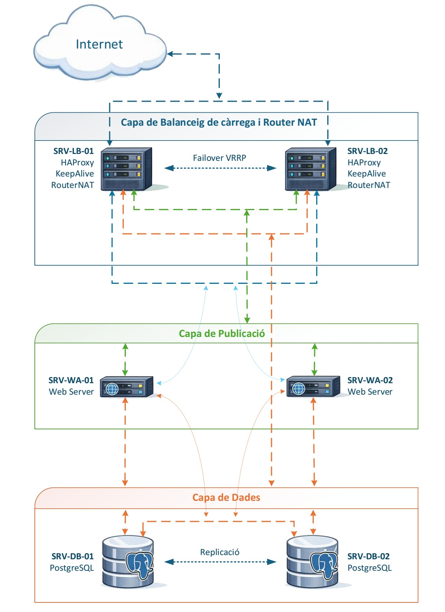

# PostgreSQL High Availability Lab

Infraestructura de alta disponibilidad con PostgreSQL, Patroni, etcd, HAProxy y Keepalived.

## Objetivo

Diseñar y validar una arquitectura capaz de mantener el servicio activo ante fallos en servidores web, base de datos, balanceadores y nodos de consenso.

## Arquitectura

- PostgreSQL + Patroni para failover automático.
- etcd en clúster de 3 nodos para consenso.
- HAProxy para redirigir tráfico al nodo PostgreSQL primario.
- Keepalived para gestión de VIPs.
- Servidores web balanceados mediante Round Robin.

## Features

- Failover automático de PostgreSQL.
- Promoción automática de réplica a líder.
- Conexión mediante VIP.
- Balanceo web con HAProxy.
- Tolerancia a fallo de un nodo etcd mediante quorum.
- Pruebas reales con DBeaver y aplicación web.

## Pruebas realizadas

- Caída de servidor web.
- Caída del nodo PostgreSQL primario.
- Inserciones después del failover.
- Caída de un balanceador.
- Caída de un nodo etcd.
- Verificación de quorum.

## Diagramas

- [Diagramas de red](diagramas_red/projecte7_esquemas.pdf)
- [Direccionamiento](diagramas_red/Direccionamiento.pdf)

## Documentación

- [Fase de pruebas](docs/FaseProves.pdf)

## Aviso

Las configuraciones incluidas son ejemplos de laboratorio. Las contraseñas, IPs y rutas deben adaptarse antes de usarse en otro entorno.
